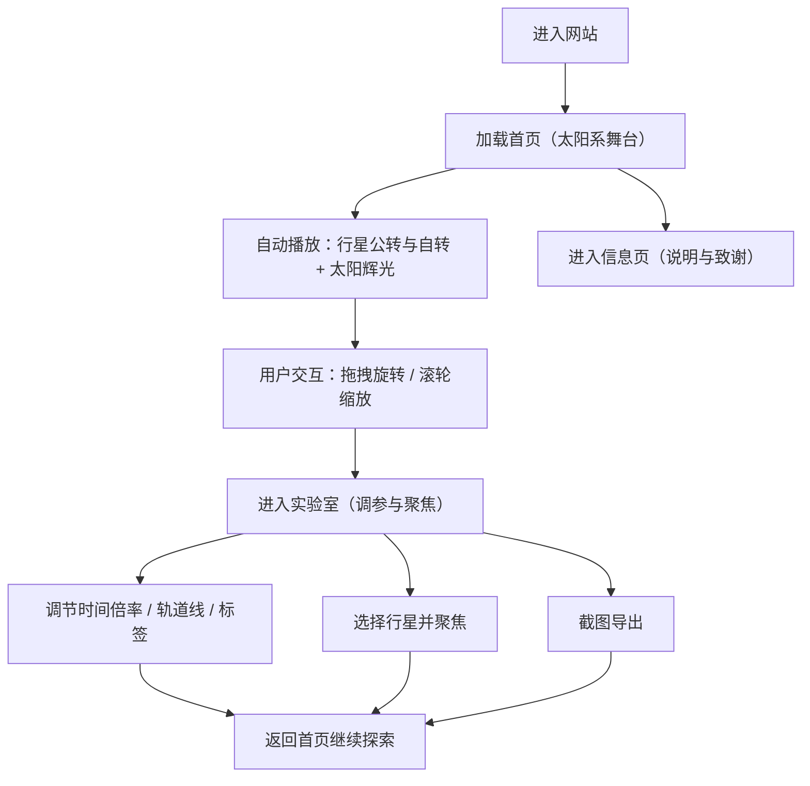

## 1. 产品概述
一款以“夸张炫酷、可交互、可探索”为核心的太阳系 3D 网站，用户可通过鼠标 360° 旋转视角与滚轮缩放，自由观察行星公转与自转。
- 目标用户：对 3D 交互与空间探索感兴趣的访客、品牌/活动展示页、科普与作品集浏览者
- 产品价值：一屏即震撼的太阳辉光与行星轨道动效，配合可控镜头，让用户产生“在宇宙里转动”的强记忆点

## 2. 核心功能

### 2.1 功能模块
1. **首页（太阳系舞台）**：全屏 3D 太阳系、镜头 360° 旋转与滚轮缩放、聚焦引导、进入实验室入口
2. **实验室（调参与聚焦）**：时间倍率、公转/自转速度、轨道线与标签开关、聚焦行星、截图导出、性能提示
3. **信息页（创作者与说明）**：控制说明、技术栈、致谢与版权说明

### 2.2 页面详情
| 页面名称 | 模块名称 | 功能描述 |
|---|---|---|
| 首页（太阳系舞台） | 太阳系场景 | 太阳（发光/辉光）+ 多颗行星（公转+自转）+ 轨道线；星空背景；镜头可 360° 旋转观察 |
| 首页（太阳系舞台） | 镜头交互 | 鼠标拖拽 360° 旋转、滚轮缩放、右键平移（可选）；双击聚焦（可选） |
| 首页（太阳系舞台） | 电影感后期 | Bloom（强化太阳辉光）、暗角、胶片颗粒；根据性能动态降级 |
| 首页（太阳系舞台） | HUD 叙事层 | 大标题与引导文案、快捷键提示、进入实验室按钮 |
| 实验室（调参与聚焦） | 参数面板 | 时间倍率、公转/自转速度、轨道线开关、标签开关、Bloom/颗粒强度、背景星密度（可选） |
| 实验室（调参与聚焦） | 聚焦控制 | 选择行星一键聚焦（平滑过渡），并可重置视角 |
| 实验室（调参与聚焦） | 截图导出 | 导出当前画面为 PNG |
| 信息页（创作者与说明） | 控制说明 | 左键拖拽旋转、滚轮缩放、（可选）右键平移；快捷键与重置说明 |
| 信息页（创作者与说明） | 技术栈与说明 | 技术栈：Vue 3 + Three.js + OrbitControls + EffectComposer；实现思路简述（层级、后期、性能分级） |
| 信息页（创作者与说明） | 致谢与版权 | 素材来源说明（如使用噪声/程序化纹理、字体授权），避免侵权风险 |

## 3. 核心流程
用户主要流程（自然语言）：
- 进入首页看到太阳系 → 拖拽 360° 旋转观察与滚轮缩放 → 进入实验室调节时间倍率/轨道/标签并聚焦行星 → 截图导出或分享 → 返回首页继续探索或查看信息页说明

## 4. 用户界面设计
### 4.1 设计风格
- 主题：深空黑为底，太阳辉光作为主视觉中心；辅以“电蓝/极光青/紫红”高对比霓虹点缀，整体偏电影海报质感
- 字体：标题使用高辨识度展示字体（偏未来/几何），正文使用更克制的无衬线字体；强调字距与大字号压迫感
- 布局：全屏沉浸 + 极简 HUD（左上标题、右下控制提示、底部进度/预设切换）
- 动效：入场分层揭示（标题逐字、HUD 延迟出现）；镜头交互时 HUD 微位移与发光呼吸；聚焦行星时相机平滑过渡
- 指针与交互：自定义光点游标（可选），hover 时产生轻微光晕与拖尾

### 4.2 页面设计概览
| 页面名称 | 模块名称 | UI 元素 |
|---|---|---|
| 首页（太阳系舞台） | HUD 叙事层 | 大标题、短副文案、交互提示（拖拽/滚轮）、进入实验室按钮、（可选）快捷键提示 |
| 首页（太阳系舞台） | 氛围层 | 暗角、胶片颗粒、渐变与噪声叠加、少量 UI 标尺/坐标装饰 |
| 实验室（调参与聚焦） | 参数面板 | 半透明玻璃拟态（更克制、更暗）、滑杆与数值输入、开关、聚焦下拉、复制/截图按钮 |
| 信息页（创作者与说明） | 说明内容 | 分组段落、键位表、性能建议、版权与致谢 |

### 4.3 响应式
- 桌面优先：默认鼠标交互与更强后期效果
- 移动端：降低粒子数量与后期采样；提供触控拖拽与可选“轻量模式”开关
- 无障碍：HUD 文案对比度达标；为关键按钮提供可聚焦样式与键盘操作

### 4.4 3D 场景指导
- 氛围：深空背景 + 轻雾化；太阳为视觉中心并带强辉光记忆点
- 灯光：太阳自发光（或高 emissive）+ 少量环境光；行星用 PBR 材质增强体积感
- 相机：OrbitControls 360° 旋转 + 滚轮缩放；限制最小/最大距离避免穿模；可做平滑阻尼
- 交互：拖拽旋转、滚轮缩放、（可选）右键平移；实验室提供“聚焦行星”与重置
- 动画：行星公转 + 自转，速度由“时间倍率”统一缩放；轨道线可开关
- 后期：Bloom 强化太阳辉光，暗角与胶片颗粒增强电影感；支持性能分级
- 性能预算：桌面目标 60fps；移动端目标 45–60fps；后期与分辨率动态降级
