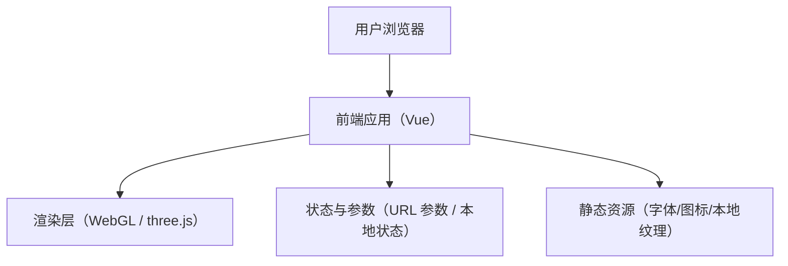

## 1. 架构设计

## 2. 技术说明
- 前端：Vue@3 + Vite（可选 TypeScript）
- 样式：Tailwind CSS（用于 HUD 与页面排版）+ 少量自定义 CSS（噪声层、光晕与动效）
- 3D：three（原生 three.js 渲染循环，Vue 仅负责 UI/HUD 与路由）
- 控制器：OrbitControls（拖拽 360° 旋转、滚轮缩放、阻尼）
- 后期：three/examples/jsm/postprocessing（EffectComposer、RenderPass、UnrealBloomPass、FilmPass、AfterimagePass、ShaderPass 等）
- 路由：vue-router
- 参数与调试：tweakpane 或 lil-gui（用于实验室参数面板）
- 截图：基于 WebGL canvas 导出（toDataURL / toBlob）
- 后端：无（纯静态站点）
- 数据：无数据库；预设参数通过 URL 查询串共享

## 3. 路由定义
| 路由 | 用途 |
|---|---|
| / | 首页（太阳系舞台） |
| /lab | 实验室（调参与聚焦） |
| /info | 信息页（说明与致谢） |

## 4. 关键模块设计

### 4.1 3D 场景模块
- SolarSystem：太阳 + 行星（SphereGeometry + PBR 材质）+ 轨道线（Line/Tube），行星公转/自转
- OrbitControls：拖拽 360° 旋转、滚轮缩放、阻尼与距离限制；可选屏蔽右键平移
- FocusController：聚焦某个行星（平滑过渡相机 target 与距离），支持重置
- RenderLoop：集中管理 requestAnimationFrame、时间尺度与暂停/恢复
- ResizeManager：监听容器尺寸与 DPR，统一更新 renderer、composer 与相机参数

### 4.2 后期与性能分级
- 后期链：Bloom（太阳辉光）→ Vignette（暗角）→ Film/Grain（颗粒）→ Afterimage（轻拖尾，可选）
- 分辨率策略：根据 devicePixelRatio 与帧率趋势动态调整 dpr 上限
- 降级策略：移动端默认降低 Bloom 与后期强度、缩小阴影/高光开销、降低 dpr 上限

### 4.3 预设与分享链接
- 预设结构：以 JSON Schema（TypeScript 类型）定义参数集合
- URL 同步：将参数序列化到查询串；进入页面时反序列化恢复
- 兼容：对未知参数进行白名单过滤，防止异常输入导致崩溃

## 5. 目录结构建议
- src/
  - app/（路由与页面壳）
  - three/（three 引擎封装：创建 renderer、scene、camera、composer）
  - scenes/（场景对象：Starfield、Nebula、Meteors、CameraRig）
  - effects/（后期链与质量分级）
  - presets/（预设与序列化）
  - ui/（HUD 组件、按钮、面板）
  - utils/（性能探测、数学工具、随机种子）

## 6. 质量与安全
- 不记录或上报任何设备指纹与性能数据（默认本地计算，仅用于自适应）
- URL 参数解析做类型校验与范围裁剪，避免极端值造成内存/性能问题
- 资源与字体遵循授权要求，信息页提供致谢与来源说明
